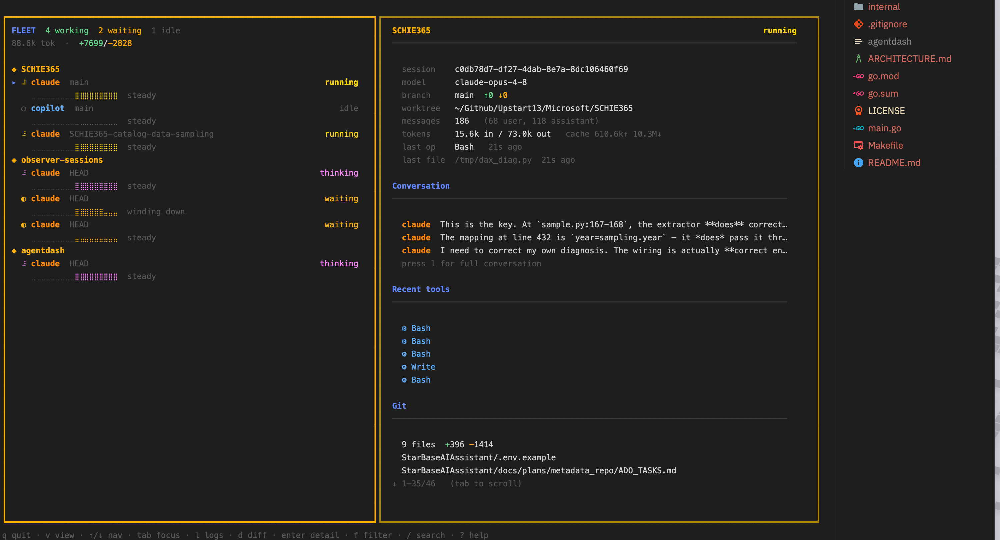
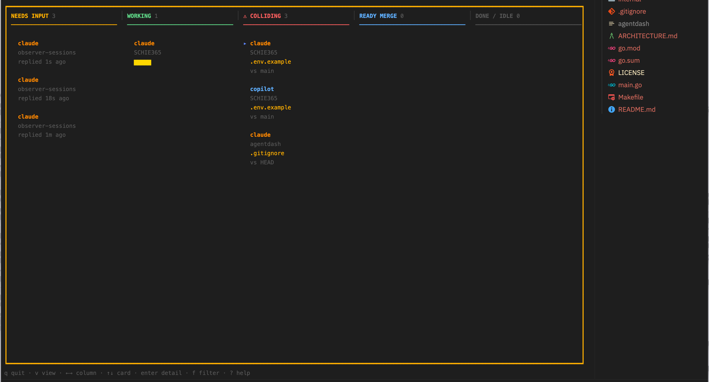

# AgentDash

A read-only terminal dashboard that monitors your local AI coding agents —
**Claude Code**, **GitHub Copilot CLI**, and others — from one place, and
correlates each running session with the **git worktree** it is working in.

Unlike session launchers, AgentDash never spawns agents. You start Claude, Copilot,
or any agent however you like; AgentDash observes them and answers the question a
launcher can't: **what work has each agent produced, and can it be merged without
collisions?**



> **Fleet view** — every running agent on the left with live activity sparklines;
> the selected session's detail, conversation preview, recent tools, and git diff
> on the right. Cycle views with `v`, navigate with `↑/↓`, open full detail with `enter`.

## Why AgentDash

When you run several agents in parallel (each in its own git worktree), the thing
that ruins your day is two agents editing the same file. AgentDash is built around
that problem:

- **Monitors all your agents** from one dashboard, observe-only (like lazyagent).
- **Correlates** each agent to its git worktree by matching the agent's working
  directory to the worktree path — so you see live activity *and* concrete git
  output side by side.
- **Cross-worktree collision detection** — flags when two agents have touched the
  same file, before you hit a merge conflict.
- **Agent-agnostic git truth** — a worktree with changes shows up whether or not an
  agent is currently attached.



> **Board view** (`v` to switch) — a kanban that sorts every session into the one
> thing you need to do next: **Needs Input**, **Working**, **⚠ Colliding**,
> **Ready Merge**, or **Done / Idle**. The Colliding column surfaces exactly which
> file two agents are both touching, before it becomes a merge conflict.

## Supported agents

| Agent | Session source | Status |
| --- | --- | --- |
| Claude Code | `~/.claude/projects/<slug>/<id>.jsonl` | ✅ verified |
| GitHub Copilot CLI | `~/.copilot/session-state/<id>/` (`COPILOT_HOME`) | ✅ verified |
| Codex CLI | `~/.codex/sessions/…` (`CODEX_HOME`) | ✅ verified |
| opencode | `~/.local/share/opencode/…` (`OPENCODE_DATA_DIR`) | ⚠️ from source schema, not live-tested |
| Kimi CLI | `~/.kimi-code/…` (`KIMI_CODE_HOME`) | ⚠️ tolerant parser, not live-tested |
| any other | running process (name + working dir) | ✅ generic process-scan fallback |

Adapters marked "not live-tested" were built from each tool's documented or
source schema but could not be verified against a local install; their field
handling should be confirmed against a real session. The process-scan fallback
ensures any agent process still appears (with alive/dir info) even without a
dedicated adapter.

Adapters implement a small `AgentAdapter` interface and self-register, so adding a
new agent is one file with no changes to the core. All session locations honor the
agent's own environment overrides — no absolute paths are hardcoded.

## Install

Requires Go 1.24+ and `git` on your `PATH`. Runs on macOS and Linux.

```sh
git clone https://github.com/datageek/agentdash
cd agentdash
go build -o agentdash .
# optionally: go install .
```

## Usage

```sh
# 1. Create ~/.agentdash/config.yaml and data directories
agentdash init

# 2. Tell AgentDash which repositories to watch (edit the config)
#    ~/.agentdash/config.yaml:
#
#      repos:
#        - ~/code/my-project
#        - ~/code/another-repo
#      refresh_seconds: 2

# 3. Open the dashboard
agentdash
```

Then start your agents as usual (in any terminal):

```sh
cd ~/code/my-project-wt-feature
claude          # or: copilot
```

AgentDash will discover the session, match it to the worktree, and show its
activity and git status — refreshing every 2 seconds.

### Activity states

Each session is tagged with a color-coded activity state, inferred from the tail
of its transcript (the same vocabulary lazyagent uses):

`thinking` · `reading` · `writing` · `running` · `searching` · `browsing` ·
`spawning` · `compacting` · `waiting` · `idle` · `exited`

Tool calls are normalized across agents — Claude's `Read` and Cursor's
`Read_file_v2` both map to `reading`; Claude's `Write` and Codex's `apply_patch`
both map to `writing`.

### Keybindings

| Key | Action |
| --- | --- |
| `q` / `ctrl+c` | quit |
| `r` | refresh now |
| `↑`/`k`, `↓`/`j` | navigate sessions (or scroll, when detail focused) |
| `tab` | switch focus between list and detail |
| `f` | cycle activity filter (all → active → waiting → idle) |
| `/` | search sessions by path / branch / agent |
| `+` / `-` | widen / narrow the time window (±10 min) |
| `l` | conversation / recent activity |
| `d` | full git diff |
| `s` | git status |
| `c` | cross-worktree collisions |
| `t` | terminal attach hint |
| `?` | help |

Detail/diff/status/conversation overlays are scrollable with `↑`/`↓`.

## Configuration

`~/.agentdash/config.yaml`:

```yaml
repos:                     # repositories whose worktrees are scanned
  - ~/code/my-project
bases:                     # optional per-repo base branch for ahead/behind
  /abs/path/to/repo: develop
agents:                    # optional: restrict to specific adapters
  - claude
  - copilot
refresh_seconds: 2         # TUI poll interval
```

You can relocate AgentDash's own data directory with `AGENTDASH_HOME`.

### Optional session overlays

Task and notes can't be observed from git or transcripts. To annotate a session,
drop a JSON file in `~/.agentdash/sessions/`, keyed by worktree path:

```json
{
  "session_id": "my-feature",
  "worktree_path": "/abs/path/to/worktree",
  "task": "wire up oauth login flow",
  "notes": "remember to run migrations"
}
```

This is purely additive — sessions appear from observation alone.

## How it works

Two collectors run concurrently on each poll:

1. **Worktree collector** (agent-agnostic) runs read-only git commands in each
   worktree: `worktree list`, `branch --show-current`, `status --short`,
   `diff --numstat`, `log base..HEAD`, `rev-list --left-right --count`.
2. **Agent collector** runs the registered adapters, each reading its agent's own
   session files to find the working directory, model, and activity.

The **correlator** joins them on the filesystem path (the agent's cwd matched to
the containing worktree) and intersects changed-file sets across worktrees to
detect collisions. No daemon, no database — just flat config plus the agents' own
files.

## Development

```sh
go test ./...      # unit tests (parsers, correlation, collisions, overlays, slug)
go vet ./...
go build ./...
```

Package layout:

```
cmd/                  cobra commands (root → TUI, init)
internal/config       config.yaml + data dirs
internal/gitutil      read-only git wrappers + porcelain parsers
internal/worktree     worktree discovery + git collection
internal/agent        AgentAdapter interface + registry
  internal/agent/claude    Claude Code adapter
  internal/agent/copilot   GitHub Copilot CLI adapter
internal/correlate    cwd↔worktree join + collision detection
internal/session      unified session model + optional JSON overlay
internal/tui          Bubble Tea dashboard
```

## Prior art & credit

AgentDash is an independent implementation inspired by several excellent tools, and
takes no code from them:

- **[lazyagent](https://github.com/illegalstudio/lazyagent)** — the observe-don't-launch behavior.
- **[Claude Squad](https://github.com/smtg-ai/claude-squad)** — the left-hand session list.
- **[agent-deck](https://github.com/asheshgoplani/agent-deck)** — the right-hand information deck and status glyphs.
- **[lazygit](https://github.com/jesseduffield/lazygit)** — the overall TUI feel.

AgentDash's distinct angle is the **git-review correlation**: monitoring agents *and*
their worktrees together, with cross-worktree collision detection.

## License

MIT
